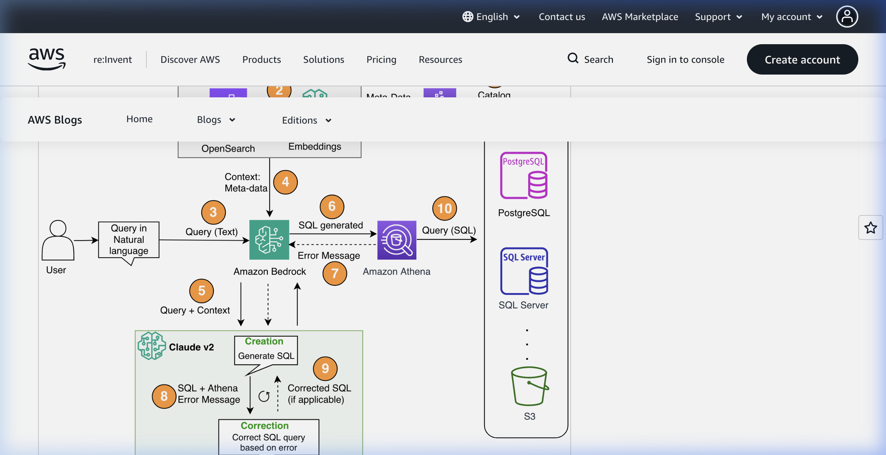

# Reference Comparison: AWS Blog Solution Architecture

This document compares our project architecture with the AWS reference architecture from the blog: [Build a robust text-to-SQL solution...](https://aws.amazon.com/blogs/machine-learning/build-a-robust-text-to-sql-solution-generating-complex-queries-self-correcting-and-querying-diverse-data-sources/)

## 1. Visual Comparison

*Figure 1: AWS Blog Architecture - Using Athena as a hub for diverse data sources.*

---

## 2. Key Differences & Similarities

| Feature | Boons Text-to-SQL Agent | AWS Blog Reference Architecture |
| :--- | :--- | :--- |
| **Primary LLM** | Gemini 2.5 Pro (Local) / Claude 3 (AWS) | Anthropic Claude v2.1 (Amazon Bedrock) |
| **Vector Store (RAG)** | local FAISS / Bedrock KB | Amazon OpenSearch Serverless |
| **Metadata Management** | Python JSON AST (`static_schema_provider.py`) | AWS Glue Data Catalog |
| **SQL Engine / Hub** | MySQL (Direct) | **Amazon Athena** (Multi-source Hub) |
| **Self-Correction** | Yes (1 retry, via `TextToSqlPort.fix_sql`) | Yes (Iterative loop, Athena error feedback) |
| **Data Diversity** | Single MySQL instance (current) | Diverse: S3, RDS, PostgreSQL, SQL Server |
| **Security Layer** | AST-based (`sqlglot`) + RLS injection | Athena Workgroup / Glue IAM policies |
| **Ingestion Pipeline** | `ingest_schema.py` (Script-based) | AWS Glue Crawler (Fully Automated) |

---

## 3. Notable Architectural Patterns

### The "Athena Hub" Pattern (AWS)
- **Concept**: Athena acts as a Federated Query engine. Instead of the LLM needing to know about multiple distinct database connections, it only talks to one SQL dialect (Athena) which then handles the translation to S3, RDS, or on-prem databases.
- **Benefit**: Simplifies the LLM prompt and reduces connection management complexity.

### The "Clean Architecture" Pattern (Boons)
- **Concept**: The Boons agent uses a strict separation of layers (Domain/Application/Infrastructure).
- **Benefit**: Allows swapping the DB executor (e.g., from `MySqlExecutor` to an `AthenaExecutor`) or the LLM provider without changing core business logic.

---

## 4. Strategic Rationale: Minimal Dependency POC

The current Boons Agent architecture was intentionally designed with **minimal external dependencies** and a **local-first** approach for the following reasons:

1.  **Cost Efficiency**: By using local FAISS and direct MySQL connections, we avoid the high starting costs of managed services like Amazon OpenSearch Serverless ($0.24/OCU-hour) or Glue Crawlers.
2.  **Market Validation**: This approach allows for a rapid "Day 0" deployment to gather user feedback and validate the Text-to-SQL accuracy without over-investing in complex cloud infrastructure.
3.  **Clean Architecture Exit Path**: Because we follow Hexagonal principles, the "minimal" parts are isolated as Infrastructure Adapters. When market validation is achieved, we can swap `LocalFaissProvider` for `AwsBedrockKbProvider` or `MySqlExecutor` for an `AthenaExecutor` with zero changes to the core `GenerateAndExecuteQueryService` logic.
4.  **Operational Simplicity**: A single Docker container with embedded FAISS indices is easier to debug and iterate upon during the initial development and prototyping phase.

---

## 5. Recommendations for Evolution
Based on the comparison, we could consider:
1.  **Transition to Athena**: If we need to query data across multiple RDS instances or S3 buckets simultaneously.
2.  **Automated Metadata Sync**: Leverage AWS Glue Crawlers to automatically update our schema JSON instead of manual ingestion.
3.  **OpenSearch for Scale**: If our knowledge base grows beyond what local FAISS can handle efficiently.
