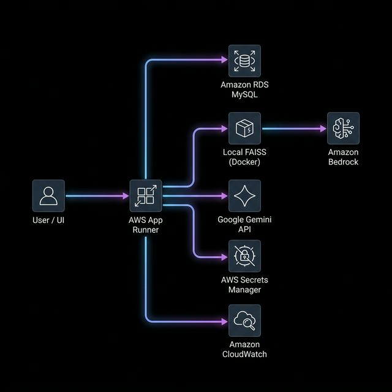

# AWS Infrastructure & Cost Strategy: Boons Text-to-SQL

This document is designed for technical and financial discussions with AWS Cloud Architects. It outlines the current state, future requirements, and cost-optimization vectors for the `boons-text-to-sql-agent`.

---

## 1. Architectural Overview
The system is a containerized FastAPI application using a hybrid AI model approach (AWS for infrastructure, Gemini for LLM reasoning).

### Core Infrastructure Components:
- **Compute**: AWS App Runner (Serverless Containers).
- **Database**: Amazon RDS for MySQL (Single-AZ for Dev; Multi-AZ for Prod).
- **AI/RAG**: **Local FAISS** index bundled within the Docker image (Current).
- **Primary LLM**: **Google Gemini 2.5 Pro** (via API).
- **Security**: AWS Secrets Manager (`LLM_API_KEY` & DB Keys), IAM Roles, VPC Connector.
- **Future Strategic Layer**: **Amazon Bedrock** (Future implementation for Guardrails, managed Knowledge Bases, and AWS-native model redundancy).

---

## 2. The Key Role of Bedrock
While Gemini and Local FAISS are the active components today, **Amazon Bedrock** provides four critical capabilities for enterprise-grade deployment:

1.  **Governance (Bedrock Guardrails)**: Mandatory safety checks (PII filtering, prompt-injection shielding) that sit independently of the model logic.
2.  **Managed RAG at Scale (Knowledge Bases)**: Automated document ingestion from S3, removing the overhead of managing local vector stores as complexity grows.
3.  **Model Broker (Flexibility)**: Allows seamless fallback or migration to **Claude 3.5 Sonnet** (optimized for SQL generation) without re-architecting.
4.  **VPC Compliance**: Use of **PrivateLink** ensures AI traffic never touches the public internet, matching high-tier SOC2 security requirements.

---

## 3. Infrastructure Requirements
| Component | Dev/QA Specification | Production Specification |
| :--- | :--- | :--- |
| **App Runner** | 1 vCPU, 2 GB RAM | 2 vCPU, 4 GB RAM (Auto-scaling) |
| **RDS (MySQL)** | db.t4g.micro (General Purpose) | db.m6g.large (Multi-AZ, Encrypted) |
| **RAG Storage** | S3 Standard (Frequent Access) | S3 Intelligent-Tiering |
| **Secrets** | 2-3 Secrets (API Keys, DB) | Centralized Multi-Region Secrets |
| **Networking** | Default VPC | Private Subnets + VPC Endpoints |

---

## 4. Cost-Optimization Roadmap
Our primary cost variable is the **RAG Vector Database**.

### Phase 1: POC / Initial Development (Current)
- **Strategy**: Maximum cost savings for small vector sets.
- **Action**: Use **Local FAISS index** bundled within the Docker image.
- **Projected Cost**: **$0.00/mo** (included in App Runner compute).

### Phase 2: Managed Development / Early Scale
- **Strategy**: Decouple RAG from the application code for easier management.
- **Action**: Migrate to **Bedrock Knowledge Bases with S3 Vector Store**.
- **Projected Cost**: **~$5.00/mo**.

### Phase 3: Mid-Term Growth
- **Strategy**: Consolidate relational and vector data for performance.
- **Action**: Use **Amazon Aurora Serverless v2 (pgvector)**.
- **Projected Cost**: **$100 - $250/mo**.

### Phase 4: High-Scale Enterprise
- **Strategy**: Managed hybrid search on millions of vectors.
- **Action**: **Amazon OpenSearch Serverless**.
- **Projected Cost**: **$350 - $720/mo**.

---

## 5. Discussion Topics for AWS Team
1.  **Hybrid Latency**: Best practices (e.g., Global Accelerator) for minimizing latency to the Google Gemini API.
2.  **PrivateLink Integration**: Connecting App Runner securely to Bedrock/RDS without public internet traversal.
3.  **Bedrock Guardrails**: Implementing automated PII filtering and audit logging for SOC2 compliance.
4.  **Compute Savings**: Eligibility for **AWS Activate Credits** or **Savings Plans** covering App Runner and Aurora.
5.  **Model Availability**: Availability timeline for **Claude 3.5 Sonnet** in the primary region.

---

## 6. Security & Compliance
- **Data Tenancy**: AST-based SQL validation ensures `MERCHANT` role-level security.
- **Secrets Protocol**: All environment variables injected at runtime via Secrets Manager.
- **Audit Logs**: Full transparency of user queries and generated SQL via CloudWatch Logs.
