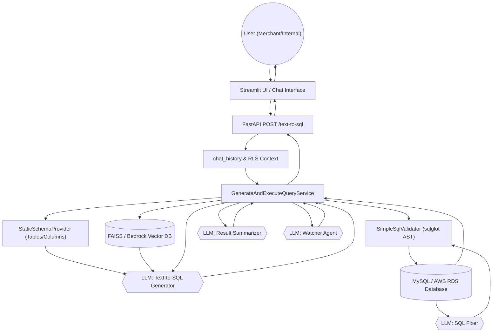

# Boons Text-to-SQL Analytics Agent: Architecture & Business Solutions

This document outlines the architecture of the Boons Text-to-SQL analytics agent, detailing how specific technical dependencies were chosen to solve core business challenges in the restaurant ordering space.

## 1. Executive Summary

The Boons Text-to-SQL agent is a conversational analytics tool built to allow internal staff and restaurant merchants to ask natural language questions (e.g., *"What were my top selling items last week?"*) and instantly receive accurate, aggregated data summaries. 

The system is built on a **Clean / Hexagonal Architecture** in Python. It heavily leverages **Retrieval-Augmented Generation (RAG)** to understand merchant-specific business terminology, **Abstract Syntax Tree (AST)** parsing to guarantee database security, and an autonomous **Self-Correction Loop** to ensure high query reliability.

---

## 2. Key Business Problems & Technical Solutions

The project requires bridging the gap between non-technical end-users (who speak in business terms) and a complex relational MySQL database (which requires strict SQL logic and security).

### Problem A: Data Isolation & Security (Row-Level Security)
Merchants must *never* be able to query or see data belonging to other restaurants. Furthermore, the AI must *never* be able to execute destructive commands (DROP, DELETE).
* **Dependency:** `sqlglot`
* **Solution:** We use `sqlglot` to parse the LLM's generated query into an Abstract Syntax Tree (AST). 
  * *Validation:* We programmatically verify the AST only contains `SELECT` statements and does not access forbidden tables.
  * *Token-Based RLS Enforcement:* Instead of trusting the AI with restaurant IDs, we use a **Mandatory Token Model**. The AI is instructed to use the placeholder `__RLS_MERCHANTS__` in its `WHERE` clause. Before execution, the `SimpleSqlValidator` scans the SQL:
    1. It rejects any query missing the token (Security Exception).
    2. It replaces the token with verified, parameterized IDs from the authenticated user context (e.g., `IN (%(rls_id_0)s, ...)`).
    This creates an "Air-Gap" between the AI's logic and the actual data isolation rules.

### Problem B: AI Understanding "Business Speak"
The database has highly specific columns (`delivery_to_pickup=0`, `grand_total`), but humans ask for things in conversational synonyms ("delivery orders", "revenue", "how many promos", "dinner sales").
* **Dependencies:** `LangChain`, `faiss-cpu`, `OpenAI Embeddings` (Local) / `Amazon Bedrock Knowledge Bases` (Production)
* **Solution:** We implemented a **Vector Store RAG** pipeline. We encode database schemas, joining rules, and a dictionary of Semantic Synonyms (e.g., mapping "dinner" to `HOUR > 17`) into a vector database. When a user asks a question, we perform a similarity search to grab the most relevant semantic rules and inject them directly into the LLM prompt, effectively teaching the AI the business domain on the fly.

### Problem C: AI Generating Bad Queries
SQL is unforgiving; a missing parenthesis or a slightly wrong table join will result in a hard crash, frustrating the user.
* **Dependencies:** `LangChain` (LLM Chains)
* **Solution:** We implemented a **Self-Correction Retry Loop** in the Execution Service. If the `aiomysql` driver returns a syntax or execution error, we catch it, pass the failing SQL and the exact error message *back* to a dedicated LLM "Fixer" chain, and ask it to correct its mistake. The system will retry the execution up to 2 times before giving up, resulting in a massively higher success rate.

### Problem D: Non-Blocking Database Connections
The agent needs to execute potentially heavy aggregation queries (e.g., month-over-month growth) without locking up the FastAPI web server.
* **Dependencies:** `aiomysql`, `asyncio`
* **Solution:** The database execution layer is fully asynchronous, utilizing non-blocking TCP connections to the MySQL / AWS RDS instance.

### Problem E: Friendly End-User Experience
Merchants don't want to see JSON arrays or raw SQL code; they want a conversational answer.
* **Dependencies:** `ChatOpenAI` / `ChatBedrock`
* **Solution:** A secondary LLM chain (`LlmSummarizer`) takes the raw data rows returned by the database and summarizes them into a polite, professional English sentence, explicitly addressing the user based on their specific Role (Merchant vs. Internal).

---

## 3. Block Diagram & Execution Flow

The following diagram illustrates the lifecycle of a single user request flowing through the system.

### Step-by-Step Component Breakdown

1. **Input (Streamlit -> FastAPI)**: The user types a question (e.g., *"How many dinner orders did I have yesterday?"*). The Streamlit UI sends this text, along with the user's role (`merchant`), authentication ID (`restaurant_id=5`), and their **`chat_history`**, to the FastAPI backend.
2. **Orchestration (`GenerateAndExecuteQueryService`)**: The main service receives the request and coordinates the entire pipeline.
3. **Context Retrieval (RAG)**:
   - **Schema**: The service pulls the static table structures and valid relationships.
   - **Vector DB**: It queries the Vector Database (FAISS locally or Bedrock on AWS) searching for "dinner orders". The database returns the semantic rule: *"Dinner means `HOUR(created_date) >= 17` and `order_status = 'completed'`"*.
4. **LLM Generation (`LangChainTextToSqlAdapter`)**: The LangChain prompt is assembled using the user's role limitations and the retrieved RAG synonyms. The LLM generates a Draft MySQL query.
   - *Draft Output*: `SELECT COUNT(*) FROM orders WHERE HOUR(...) >= 17...`
5. **Security & Validation (`SimpleSqlValidator`)**: 
   - Uses `sqlglot` to parse the Draft SQL into a strict mathematical tree (AST). 
   - It blocks destructive queries (DROP, DELETE).
   - *RLS Injection*: It injects `WHERE restaurant_id IN (5)` dynamically into the query logic to guarantee the merchant cannot see data for Restaurant 8.
6. **Execution (`MySqlExecutor`)**: The validated SQL is sent async to the actual database structure.
7. **Self-Correction Loop**: 
   - If MySQL throws an error (e.g., "Unknown column"), the Service catches it. 
   - It sends the broken SQL and the exact error to a secondary **SQL Fixer** LLM to correct the mistake. It retries this up to 2 times automatically.
   - If successful, MySQL returns the aggregated data rows.
8. **Result Summarization & Visualization (`LlmSummarizer`)**:
   - The aggregated raw data rows are fed into the Summarizer LLM.
   - It drafts a highly professional, natural language summary of the data matching the user's role (e.g. "You had 23 dinner orders yesterday").
   - **Dynamic Data Visualization**: If the LLM detects a trend, ranking, or comparison (e.g. "top 5 items" or "monthly growth"), it intercepts the raw rows and natively generates a **Vega-Lite JSON chart specification**.
9. **QA & Compliance (`LlmWatcherAgent`)**: 
   - A distinct "Watcher" LLM agent audits the draft summary for factual accuracy against the raw JSON. 
   - It enforces Zero Tech Jargon (no mention of SQL, rows, or tables) and verifies tone and social safety. If the draft fails, the Watcher intercepts and corrects it.
10. **Output (FastAPI -> Streamlit -> User)**: The approved conversational summary, row data, and optional `chart_spec` are returned to the user, where the UI renders them as chat text and interactive native charts.

---

## 4. Architecture Layers & Flow

The application follows strictly decoupled layers:

### A. Interface / Delivery (`interface/api/routes.py`)
Provides the FastAPI endpoints. Converts HTTP JSON into domain models (`Question`, `Role`) and triggers the main application service. 

### B. Application Use Case (`application/services.py`)
The orchestrator (`GenerateAndExecuteQueryService`). 
1. Fetches Schema Manifest.
2. Calls `text_to_sql` to generate a query.
3. Calls `sql_validator` to verify and inject RLS.
4. Calls `sql_executor` to run against MySQL (wrapping in the Self-Correction try/catch block).
5. Calls `result_summarizer` to generate the English response.

### C. Infrastructure Implementations (`infrastructure/`)
Contains the specific libraries that fulfill the application interfaces:
* **Retrieval (`retrieval/vector_store.py`)**: The `FAISS` / `Bedrock` integration for RAG.
* **Security (`security/simple_sql_validator.py`)**: The `sqlglot` AST parsing logic.
* **LLM (`llm/langchain_text_to_sql.py`)**: The LangChain prompt chaining and structured output generation.
* **Database (`db/mysql_executor.py`)**: The `aiomysql` connection pooling and execution.

### D. Environment Portability
By utilizing standard LangChain interfaces, the `Settings` module seamlessly toggles dependencies based on the environment:
* **`ENVIRONMENT=local`**: Uses local Docker MySQL, `ChatOpenAI`, and local `FAISS` vector embeddings.
* **`ENVIRONMENT=aws-*`**: Uses AWS RDS MySQL, Amazon Bedrock `ChatBedrock` (Claude models), and Amazon OpenSearch via Bedrock Knowledge Bases. No application code needs to be rewritten.
